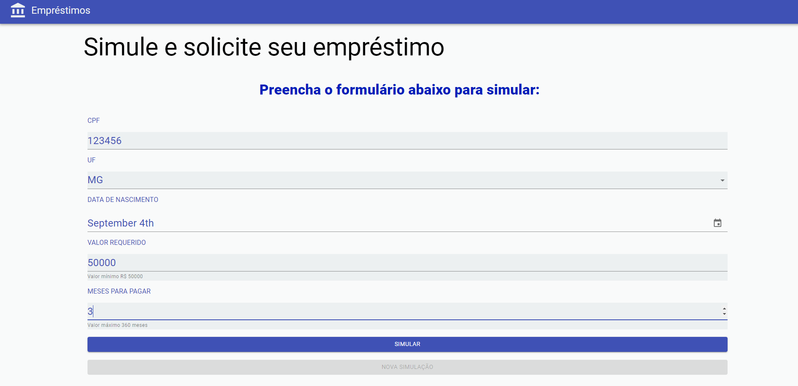
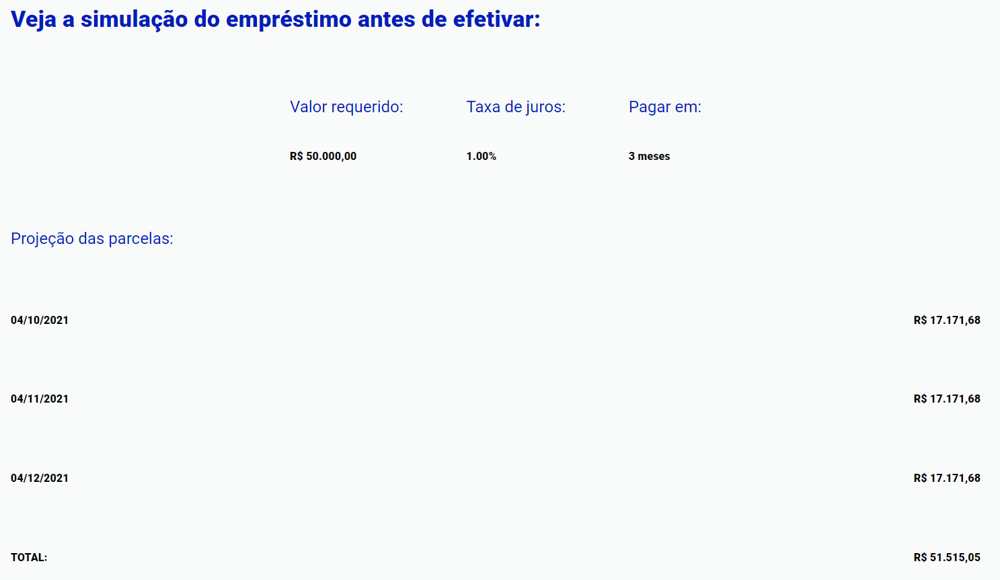
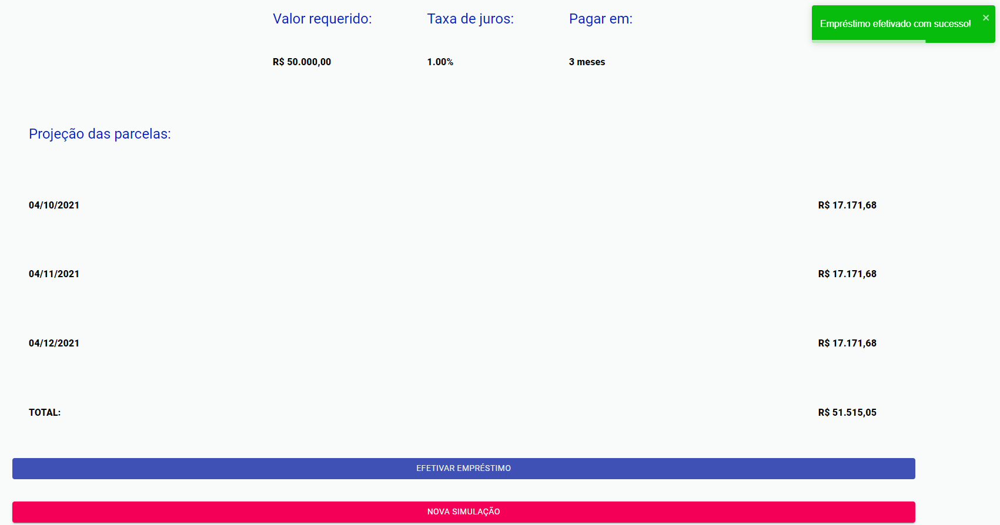

# Desafio Letalk

O projeto está disponível no [Heroku](https://desafio-letalk.herokuapp.com/).

## Instalação
##### OBS: todos os comandos são considerando a pasta root (desafio-emprestimo) como inicial.

O projeto está divido entre a **API e frontend**, então serão necessárias duas instalações, uma dentro da pasta API:

    $ cd API
    $ yarn install

E outra no **front**:

    $ cd Frontend
    $ yarn install

## Rodando o projeto

Novamente, como o projeto está dividido em duas partes, primeiro iniciamos o **backend**:

    $ cd API
    $ yarn start

E depois no **front**:

    $ cd Frontend
    $ yarn start

A aplicação tem somente uma página, onde pode-se realizar a simulação e efetivação de um empréstimo.

Clicando no botão **simular**, são carregados os dados relativos a simulação especificada:

Clicando no botão **efetivar empréstimo** recebemos a mensagem de sucesso.

O botão **nova simulação** limpa os campos do formulário para realizar uma nova simulação.

## Rotas

Informações mais detalhadas das rotas no [swagger](https://petstore.swagger.io/?url=https://raw.githubusercontent.com/dutomazoni/challenge-20201209/master/API/Routes/swagger.yaml).

## Testes das rotas

Para realizar os testes das rotas, basta entrar na pasta API e rodar o seguinte script:

    $ cd API
    $ yarn start-and-test
